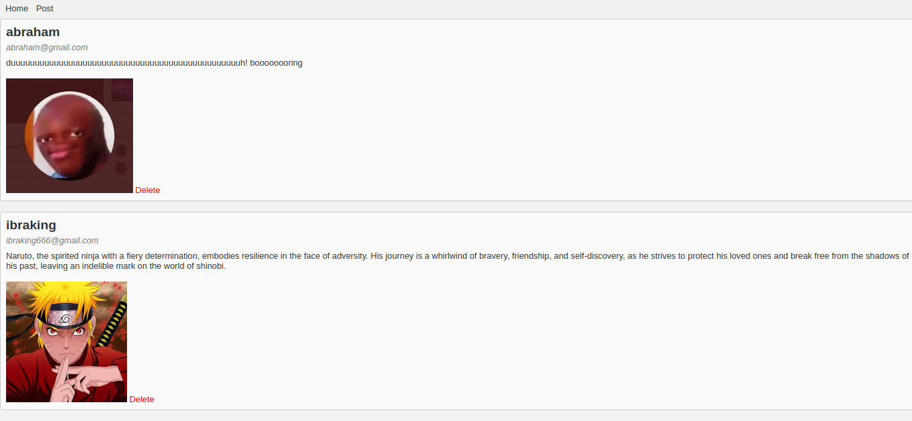

# Basic Blog Post Website
This is a basic blog post website built using Flask. It allows you to create, view, edit, and delete blog posts. The website does not include user authentication, and anyone can access and interact with the posts

# Features
Create a new blog post by providing a title, content, and an image URL.
View a list of all existing blog posts, sorted by the most recent ones.
Delete a blog post, removing it from the website.
Installation
Clone the repository:

bash
Copy code
https://github.com/Hajiub/flask-blog-post.git
Navigate to the project directory:

```bash
cd flask-blog-post
Create a virtual environment:
```
```bash
python -m venv venv
```

Activate the virtual environment:

For Windows:
```bash
venv\Scripts\activate
```
For Unix or Linux:
```bash
source venv/bin/activate
```
Install the required dependencies:

```bash
pip install -r requirements.txt
```
Set the environment variables:

For Windows (Command Prompt):

```bash
set FLASK_APP=app.py
set FLASK_ENV=development
```
For Windows (Powershell):
```bash
$env:FLASK_APP = "app.py"
$env:FLASK_ENV = "development"
```
For Unix or Linux:

```bash
export FLASK_APP=app.py
export FLASK_ENV=development
```
Run the application:
```bash
#  create a migration repository
flask db init
# generate an initial migration
flask db migrate -m "Initial migration."
# apply the changes to the  database
flask db upgrade
# run the application 
flask run
```
Open your web browser and visit http://localhost:5000 to access the basic blog post website.


## home page screenshot

